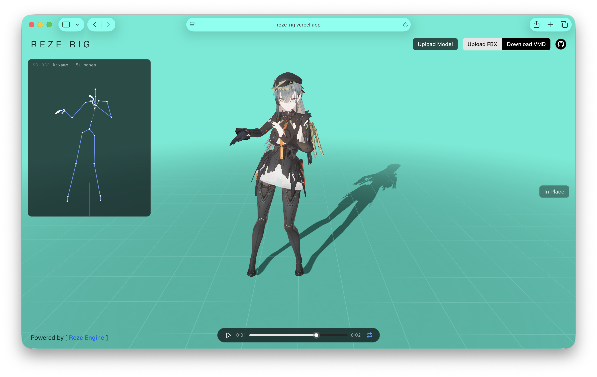

# Mixamo-MMD

Convert humanoid FBX animations into MMD VMD files in the browser. Upload an FBX, watch it play on a PMX model, and download the VMD — no Blender, no Maya, no plugins.



Powered by [Reze-Engine](https://github.com/AmyangXYZ/reze-engine)

## What it does

The retarget pipeline takes the FBX's bone rotation curves, expresses each bone's animation as a *world-orientation delta from rest*, and rewrites it as parent-local rotations on the MMD bone hierarchy (センター / 上半身 / 左腕 / etc.). Because the source rig and the MMD model have different bind poses, bone-axis conventions, and proportions, a few calibrations happen automatically:

- **Bone name canonicalization.** Mixamo's `mixamorig:*` names and UE-Mannequin / Unity Humanoid names (`pelvis`, `upperarm_l`, `clavicle_r`, …) are mapped to a shared canonical naming scheme, then to MMD's Japanese bone names.
- **Cross-bone parent propagation.** Each MMD bone's local rotation is computed as `parent_target_world(t)⁻¹ · target_world(t)`, so the runtime engine's parent×child composition reconstructs the correct world orientation even when the source rig has non-identity bind orientations along the spine.
- **A-pose ↔ T-pose arm bias, auto-calibrated.** The MMD mesh is skinned in A-pose; source rigs may be T-pose (Mixamo) or A-pose (UE-Mannequin). The retargeter measures the source's bind arm direction at runtime and computes the per-side rotation needed to display the source's rest pose correctly on the A-pose mesh — no hardcoded 35°.
- **Bind-reference override for broken exports.** Some Unity per-pose clips (`Run_Lfoot.fbx`, `Run_Stop_*`) embed the *first animation frame* as their FBX rest pose instead of the real bind. When a UE-style clip is detected, the retargeter substitutes the canonical bind from `Idle.fbx` so "delta from rest" references the correct baseline.

## Supported source rigs

- **Mixamo** (T-pose, `mixamorig:` prefixed bones)
- **UE-Mannequin / Unity Humanoid** (A-pose, `pelvis` / `upperarm_l` / `thigh_l` style bones)

Other humanoid rigs (Maya HumanIK, Daz, VRoid, custom) need their bone names added to the canonicalization table — the retarget math itself is rig-agnostic.

## Project structure

```
app/page.tsx       — UI, engine setup, file upload, animation playback
lib/fbx.ts         — Binary FBX parser, animation curve extraction
lib/retarget.ts    — FBX → MMD VMD retarget (rotations + Hips translation)
lib/vmd-writer.ts  — VMD binary serialization
```